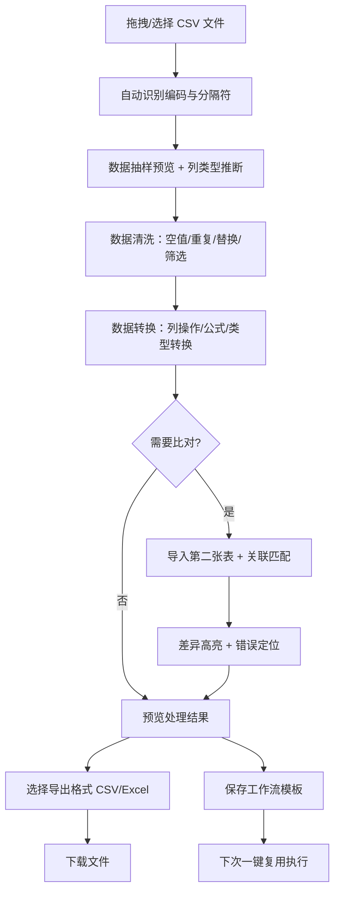

## 1. 产品概述

纯前端 CSV 数据工作台，面向运营、财务等非技术人员，在浏览器本地完成表格文件的全流程处理，零上传、零安装、零延迟。

- 解决痛点：Excel 卡顿、Python 脚本门槛高、在线工具数据隐私风险
- 核心价值：本地处理保障数据安全，可视化操作降低技术门槛，工作流复用提升效率

## 2. 核心功能

### 2.1 用户角色

| 角色 | 注册方式 | 核心权限 |
|------|----------|----------|
| 运营人员 | 无需注册 | 数据清洗、格式转换、报表导出 |
| 财务人员 | 无需注册 | 多表比对、公式计算、差异分析 |
| 数据分析师 | 无需注册 | 高级筛选、列变换、工作流记录 |

### 2.2 功能模块

1. **文件区**：拖拽导入、多文件管理、编码识别、分隔符配置
2. **预览区**：数据抽样、行列统计、列类型推断、数据概览
3. **清洗区**：空值处理、重复行检测、批量替换、条件筛选、错误定位
4. **转换区**：列拆分/合并、类型转换、公式列生成、数据规范化
5. **比对区**：两表关联匹配、主键对齐、差异高亮、变更统计
6. **导出区**：CSV/Excel 格式导出、自定义分隔符、编码选择
7. **任务记录**：操作步骤序列化、工作流模板保存、一键复用执行

### 2.3 页面详情

| 页面名称 | 模块名称 | 功能描述 |
|----------|----------|----------|
| 主工作台 | 文件区 | 拖拽上传区 + 文件列表卡片 + 编码/分隔符设置面板 |
| 主工作台 | 预览区 | 数据表格（固定表头）+ 统计面板 + 列类型标签 |
| 主工作台 | 清洗区 | 空值标记器 + 重复行高亮 + 替换表单 + 筛选构建器 |
| 主工作台 | 转换区 | 列操作面板 + 公式编辑器 + 类型转换下拉框 |
| 主工作台 | 比对区 | 左右双表视图 + 关联键选择 + 差异颜色图例 |
| 主工作台 | 导出区 | 格式选择器 + 范围配置 + 下载按钮组 |
| 主工作台 | 任务记录 | 时间线操作历史 + 模板保存/加载 + 回放执行按钮 |

## 3. 核心流程

用户导入 CSV 文件 → 系统自动识别编码与分隔符 → 预览数据并推断列类型 → 执行清洗/转换操作（可多步）→ 可选执行两表比对 → 预览处理结果 → 导出目标格式 → 保存操作步骤供下次复用。

## 4. 用户界面设计

### 4.1 设计风格
- **主色调**：深青蓝色 `#0F766E`（专业可靠）搭配琥珀橙 `#F59E0B`（强调操作）
- **背景层次**：主面板浅灰 `#F8FAFC`，卡片纯白 `#FFFFFF`，边框细灰 `#E2E8F0`
- **按钮风格**：圆角 8px，主按钮实色填充，次按钮描边空心，图标按钮纯透明
- **字体方案**：标题 `Noto Sans SC`（思源黑体）700 粗体，正文 `Inter` 400-500，数字 `JetBrains Mono` 等宽
- **布局结构**：左侧模块导航（7 图标垂直）+ 中央工作区（Tab 切换）+ 右侧属性面板 + 底部任务记录条
- **图标风格**：Lucide 线性图标，统一 18px 尺寸，激活态填充当前主色

### 4.2 页面设计概览

| 页面名称 | 模块名称 | UI 元素 |
|----------|----------|---------|
| 主工作台 | 文件区 | 虚线拖拽框 + 悬浮动画 + 文件卡片（文件名/行数/大小/操作） |
| 主工作台 | 预览区 | 虚拟滚动表格 + 列头类型徽章 + 统计数据卡片（4宫格） |
| 主工作台 | 清洗区 | 标签页切换空值/重复/替换/筛选 + 操作列表 + 执行按钮 |
| 主工作台 | 转换区 | 列卡片拖拽排序 + 公式编辑器（代码高亮）+ 预览小窗 |
| 主工作台 | 比对区 | 双列联动滚动 + 行级颜色差异（新增绿/删除红/修改橙） |
| 主工作台 | 导出区 | 格式单选卡片 + 编码下拉 + 范围输入 + 大下载按钮 |
| 主工作台 | 任务记录 | 可折叠底部抽屉 + 时间线节点 + 保存模板弹窗 |

### 4.3 响应式

- **桌面优先**：断点 1280px，标准三栏布局（导航 + 工作区 + 面板）
- **平板适配**：900px 断点，右侧面板折叠为浮动抽屉，导航压缩为图标
- **移动端**：640px 断点，底部 Tab 导航替代侧边栏，表格横向滚动 + 冻结首列

### 4.4 交互动效

- 拖拽导入：文件悬停时边框加粗 + 背景色渐变 + 抖动提示
- 模块切换：页面内容右滑进入 + 导航图标缩放高亮
- 数据处理：进度条骨架屏 + 结果淡入 + 操作计数 Toast 提示
- 差异高亮：行级颜色渐变过渡，鼠标悬停显示变更详情 Tooltip
- 任务回放：步骤节点依次点亮动画 + 当前执行步骤脉动呼吸效果
