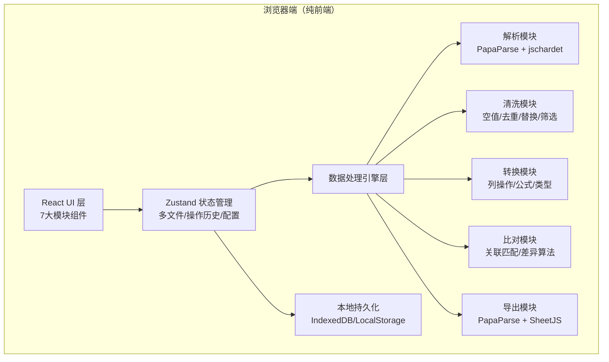
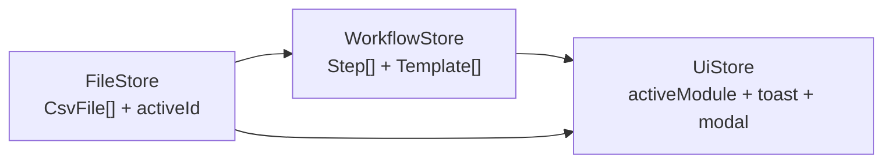

## 1. 架构设计



## 2. 技术描述

- **前端框架**：React@18 + TypeScript@5
- **构建工具**：Vite@5
- **样式方案**：TailwindCSS@3 + 自定义 CSS 变量主题
- **状态管理**：Zustand（轻量，支持 DevTools 与持久化中间件）
- **UI 组件**：Lucide React（图标）+ 自定义组件库（无组件库依赖，保持轻量）
- **CSV 解析/生成**：PapaParse（高性能流式解析，自动分隔符识别）
- **编码检测**：jschardet（GBK/UTF-8/GB2312 等中文字符集识别）
- **Excel 导出**：SheetJS (xlsx)（导出 .xlsx 格式）
- **公式引擎**：expr-eval（轻量表达式解析器，支持列引用、算术、统计函数）
- **数据虚拟滚动**：@tanstack/react-table + 原生 IntersectionObserver（大表格性能优化）
- **本地持久化**：LocalStorage（配置与模板）+ IndexedDB（大文件缓存可选）

## 3. 目录结构

```
src/
├── components/
│   ├── layout/              # 布局组件
│   │   ├── Sidebar.tsx      # 左侧模块导航
│   │   └── TaskHistory.tsx  # 底部任务记录抽屉
│   ├── files/               # 文件区模块
│   │   ├── DropZone.tsx
│   │   ├── FileList.tsx
│   │   └── EncodingPanel.tsx
│   ├── preview/             # 预览区模块
│   │   ├── DataTable.tsx
│   │   ├── StatsPanel.tsx
│   │   └── ColumnTypeBadge.tsx
│   ├── clean/               # 清洗区模块
│   │   ├── NullHandler.tsx
│   │   ├── DuplicateFinder.tsx
│   │   ├── BulkReplace.tsx
│   │   └── FilterBuilder.tsx
│   ├── transform/           # 转换区模块
│   │   ├── ColumnSplitter.tsx
│   │   ├── ColumnMerger.tsx
│   │   ├── FormulaEditor.tsx
│   │   └── TypeConverter.tsx
│   ├── compare/             # 比对区模块
│   │   ├── DualTable.tsx
│   │   ├── KeySelector.tsx
│   │   └── DiffLegend.tsx
│   ├── export/              # 导出区模块
│   │   ├── FormatSelector.tsx
│   │   ├── ExportOptions.tsx
│   │   └── DownloadButton.tsx
│   └── common/              # 通用组件
│       ├── Button.tsx
│       ├── Modal.tsx
│       ├── Toast.tsx
│       └── Tabs.tsx
├── store/                   # 状态管理
│   ├── useFileStore.ts      # 文件与数据状态
│   ├── useWorkflowStore.ts  # 工作流与任务记录
│   └── useUiStore.ts        # UI 交互状态
├── engine/                  # 数据处理引擎
│   ├── parser.ts            # CSV 解析与编码检测
│   ├── cleaner.ts           # 清洗算法
│   ├── transformer.ts       # 转换算法
│   ├── differ.ts            # 比对算法
│   ├── exporter.ts          # 导出逻辑
│   ├── formula.ts           # 公式引擎封装
│   └── types.ts             # 类型定义
├── hooks/                   # 自定义 Hooks
│   ├── useVirtualScroll.ts
│   ├── useDragDrop.ts
│   └── useToast.ts
├── utils/                   # 工具函数
│   ├── format.ts
│   ├── detectType.ts        # 列类型推断
│   └── storage.ts
├── App.tsx
├── main.tsx
└── index.css
```

## 4. 核心数据模型

### 4.1 文件状态模型

```typescript
interface CsvFile {
  id: string;
  name: string;
  size: number;
  encoding: string;
  delimiter: string;
  headers: string[];
  columns: ColumnInfo[];
  rows: DataRow[];
  rowCount: number;
  importedAt: number;
  meta: {
    nullCount: number;
    duplicateCount: number;
    samples: DataRow[];
  };
}

interface ColumnInfo {
  name: string;
  index: number;
  type: 'string' | 'number' | 'date' | 'boolean' | 'mixed';
  inferred: boolean;
  nullCount: number;
  uniqueCount: number;
  sampleValues: (string | number | null)[];
}

interface DataRow {
  _id: string;
  _index: number;
  _flags: {
    isNull?: boolean;
    isDuplicate?: boolean;
    isFiltered?: boolean;
    modified?: boolean;
  };
  values: Record<string, string | number | null>;
}
```

### 4.2 工作流步骤模型

```typescript
type WorkflowStep =
  | { type: 'IMPORT'; payload: { fileName: string; encoding: string; delimiter: string } }
  | { type: 'MARK_NULL'; payload: { columns: string[]; marker: string } }
  | { type: 'REMOVE_NULL'; payload: { columns: string[]; mode: 'any' | 'all' } }
  | { type: 'REMOVE_DUPLICATES'; payload: { columns: string[]; keepFirst: boolean } }
  | { type: 'REPLACE'; payload: { column: string; find: string; replace: string; regex: boolean } }
  | { type: 'FILTER'; payload: { conditions: FilterCondition[]; logic: 'AND' | 'OR' } }
  | { type: 'SPLIT_COLUMN'; payload: { source: string; delimiter: string; targets: string[] } }
  | { type: 'MERGE_COLUMNS'; payload: { sources: string[]; target: string; separator: string } }
  | { type: 'FORMULA_COLUMN'; payload: { target: string; expression: string } }
  | { type: 'CONVERT_TYPE'; payload: { column: string; toType: ColumnInfo['type']; format?: string } }
  | { type: 'COMPARE'; payload: { otherFileId: string; keys: string[]; mode: 'inner' | 'left' | 'full' } }
  | { type: 'EXPORT'; payload: { format: 'csv' | 'xlsx'; fileName: string; encoding: string } };

interface WorkflowTemplate {
  id: string;
  name: string;
  description: string;
  steps: WorkflowStep[];
  createdAt: number;
  usageCount: number;
}
```

### 4.3 比对差异模型

```typescript
interface DiffResult {
  keyColumn: string;
  added: DiffRow[];
  removed: DiffRow[];
  modified: ModifiedRow[];
  unchanged: string[];
  stats: {
    leftOnly: number;
    rightOnly: number;
    bothChanged: number;
    bothSame: number;
    totalDiff: number;
  };
}

interface ModifiedRow {
  key: string;
  left: DataRow;
  right: DataRow;
  changedColumns: string[];
}
```

## 5. 状态管理 Store 分区



- **useFileStore**：管理所有已导入文件（原始 + 处理后快照）、激活文件切换、编码/分隔符配置变更
- **useWorkflowStore**：操作步骤入栈/撤销/重做、模板 CRUD、步骤回放执行器
- **useUiStore**：当前激活模块索引、Toast 消息队列、Modal 开关、侧边栏折叠状态

## 6. 关键性能策略

1. **虚拟滚动**：>1000 行自动启用 `IntersectionObserver` 渲染可视区域，列数 >50 时启用横向懒渲染
2. **不可变数据 + Immer**：状态更新使用 Immer 保证引用稳定，避免表格全量重渲染
3. **Web Worker 分片**：>10 万行数据在 Worker 中分片处理（2000 行/片），主线程只渲染进度
4. **快照对比**：清洗/转换操作仅计算变更 Diff，局部更新 DataRow._flags，不重建全数组
5. **公式列缓存**：表达式 AST 解析一次后缓存，逐行执行复用，依赖列变更时失效重算
